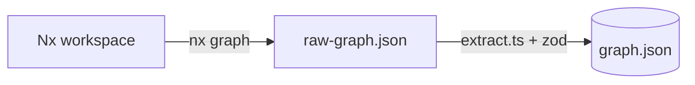

# RepoLens — Architecture

## Pipeline

- **Step 1**: turn Nx's sprawling raw dump into a small, trustworthy `graph.json` that every later step reads. `graph.json` is the data contract
   - Key decision: **Normalized model** with typed `nodes` (id, label, type, root, tags, `fanIn`, `fanOut`) + `edges` (source, target, type) + `stats`, all validated by [zod](https://zod.dev).

## ADR — key decisions

1. **Normalized intermediate model, not Nx's raw JSON.**
   Nx emits a huge object per project (build targets, executors, caching config,
   metadata). The map needs maybe five fields. Reshaping into a small model
   means downstream code reads `node.fanIn` instead of digging through
   `data.targets.build.options.…`, and provides a stable contract to design visualizations against. 

2. **Validate at the boundary with zod, don't trust the input.**
   `raw-graph.json` comes from an external tool (or a hand-edit), so it is treated as
   untrusted. `RawGraph.parse()` checks the shape the moment we read it and fails
   with a clear message if it's wrong. Quick failures ensure we raise issues immediately -- "your input is malformed, here's where."

3. **Tradeoff: extra mapping code in exchange for decoupling.**
   A `RawNode`/`RawEdge` schema plus a mapping step that has to be
   updated when we want a new field. Known tradeoff: the UI never imports
   anything Nx-shaped, so an Nx upgrade can't ripple past `extract.ts`. For a tool
   meant to be reused across repos and Nx versions, that isolation is worth the
   handful of extra lines.

4. **Failure modes considered.**
   - *Nx changes its graph shape* → the loose `RawGraph` schema only asserts the few
     fields we use, so unrelated changes pass through untouched; a change to a field
     we *do* rely on fails loudly at `parse()` instead of silently.
   - *A node is missing data* → `tags` is optional and defaults to `[]`; `label`
     falls back to the project id.
   - *An edge points nowhere* → dependencies on external npm packages (or any
     unknown target) are dropped and counted, never emitted as dangling nodes.

5. **`.catch()` defaults instead of throwing on unknown enums.**
   `type` uses `.catch("lib")` and edge `type` uses `.catch("static")`. A new node
   or edge kind we haven't seen shouldn't blow up the whole extraction — far better
   to render that project as a generic library and keep going than to lose the
   entire map over one unfamiliar value.

## Future Considerations
- how can this be useful for finding information needed quickly within a monorepo? Visualization allows you to click a node and open the repo in IDE?
- who is this targeting? new developers? what information is lacking? what information could be useful?
- how can this graph structure be extendable to other domains/areas?